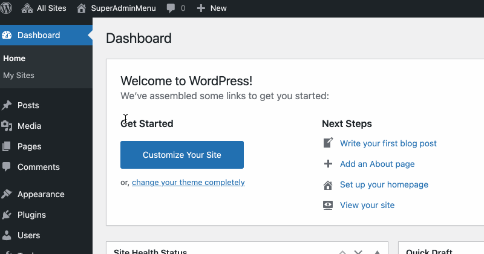
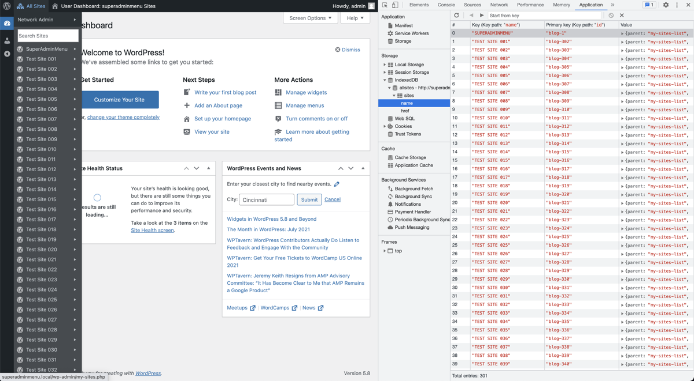

# Super Admin All Sites Menu

> Also available at https://wordpress.org/plugins/super-admin-all-sites-menu/

[Use](#use) | [Prerequisite](#prerequisite) | [Install](#install) | [Filters](#filters) | [Demo](#demo) | [Behind the scenes](#behind-the-scenes) | [Changelog](CHANGELOG.md)

For the super admin, replace WP Admin Bar My Sites menu with an All Sites menu.

- [Doesn't use `switch_to_blog()`](https://github.com/soderlind/super-admin-all-sites-menu/blob/main/super-admin-all-sites-menu.php#L370-L375), i.e. Super Admin All Sites Menu is faster and uses less resources than the WP Admin Bar My Sites menu.
  - `get_blog_details('blogname')` use `switch_to_blog()`, `$site->__get( 'blogname' )` doesn't.
  - `get_site_url()` use `switch_to_blog()`, `$site->__get( 'siteurl' )` doesn't.
- Subsite menu data are stored locally in IndexedDB (did I say it's fast?). The local storage is updated when;
  - the plugin is activated.
  - a site is added or deleted.
  - you change a blog name.
  - IndexedDB is out of sync with site changes.
  - [Restricted Site Access](https://github.com/10up/restricted-site-access) is activated or deactivated.
- When subsite menu data is updated, REST is used and it's done in increments (100 sites per increment).
- List all subsites. WP Admin Bar My Sites only list sites you're a local admin on.
- Mark sites that [has Restricted Site Access activated](https://github.com/soderlind/super-admin-all-sites-menu/blob/main/super-admin-all-sites-menu.php#L381-L384) with a red icon.
- Sites menu is sorted alphabetically.
- Search filter.
- Add more menu choices:
  - Under "Network Admin"
    - Add New Site
  - Per subsite.
    - 'New Page'
    - 'Users'
    - 'Plugins'
    - 'Settings'

> Inspired by [WP REST API vs admin-ajax.php vs Must-Use Plugin: Handling AJAX Requests in WordPress](https://deliciousbrains.com/comparing-wordpress-rest-api-performance-admin-ajax-php/), I wrote [a must-use plugin](https://gist.github.com/soderlind/0de1272f1be1b3c79d43dd2c51dbddca) that makes the plugin go from fast to faster (ca 60% faster). Save [the file](https://gist.githubusercontent.com/soderlind/0de1272f1be1b3c79d43dd2c51dbddca/raw/2a5797f9d9ed5f0fb9e7e2a912870a8d9c51cfb3/mu-super-admin-all-sites-menu.php) in `mu-plugins`.

## Use



## IndexedDB

Menu data are stored locally in IndexedDB.



## Prerequisite

- WordPress Multisite
- A modern browser, IE 11 isn't supported.

## Install

> Also available at https://wordpress.org/plugins/super-admin-all-sites-menu/

- [Download the plugin](https://github.com/soderlind/super-admin-all-sites-menu/archive/refs/heads/main.zip)
- [Upload and network activate the plugin](https://wordpress.org/support/article/managing-plugins/#manual-upload-via-wordpress-admin)

Also available via composer:

```bash
composer require soderlind/super-admin-all-sites-menu
```

## Filters

You can use the following filters to override the defaults:

- `all_sites_menu_order_by`
  - Sort menu by. Default value is `name`, accepts `id`, `url` or `name`
    ```php
    add_filter( 'all_sites_menu_order_by', function( string $order_by ) : string {
    	return 'url';
    } );
    ```
- `all_sites_menu_load_increments`
  - REST load increments. Default value is 100.
  ```php
  add_filter( 'all_sites_menu_load_increments', function( int $increments ) : int {
  	return 300;
  } );
  ```
- `all_sites_menu_plugin_trigger`
  - Trigger an update of local storage (IndexedDB) when a plugin is (de)activated. Default is `[ 'restricted-site-access/restricted_site_access.php' ]`.
    > Note: Must be an array and each element in the array must point to the main plugin file. Syntax `'plugin-dir/plugin-file.php'`
  ```php
   add_filter( 'all_sites_menu_plugin_trigger', function( array $plugins ) : array {
  	return [
  		'restricted-site-access/restricted_site_access.php',
  		'myplugin/myplugin.php',
  	];
  } );
  ```
- `all_sites_menu_search_threshold`
  - Don't display search field if there's less than N subsites. Default value is 20.
  ```php
  add_filter( 'all_sites_menu_search_threshold', function( int $increments ) : int {
  	return 40;
  } );
  ```
- `all_sites_menu_force_refresh_expiration`
  - How often a forced refresh should be taken. Default value is `3600`. Set the value to `0` to disable forced refresh.
    ```php
    add_filter( 'all_sites_menu_force_refresh_expiration', function( int $seconds ) : int {
    	return 3600;
    } );
    ```

## Demo

A demo is available in [WordPress Playground](https://playground.wordpress.net/?blueprint-url=https://raw.githubusercontent.com/soderlind/super-admin-all-sites-menu/refs/heads/main/blueprint.json). It's a bit slow loading, 50 subsites are added.

- If you disable Super Admin All Sites Menu in the Main Site plugins menu, you'll see the WP Admin Bar My Sites menu doesn't allow you to scroll and see all sites. This is a 14-year-old (!) [bug on WordPress](https://core.trac.wordpress.org/ticket/15317).

- If you activate the Restricted Site Access plugin (included), you'll see a red icon next to the site name. ATM, this only works on the main site due to [issues with WordPress Playground](https://github.com/WordPress/wordpress-playground/issues/2054).

## Behind the scenes

> Written by Claude 3.5 Sonnet, prompt in GitHub Copilot: `@workspace list the dataflow, step by step`

Let me break down the dataflow related to the timestamp in the super-admin-all-sites-menu plugin:

1. **Initial Timestamp Creation**:

   - In super-admin-all-sites-menu.php, a timestamp is generated when the plugin initializes
   - This is exposed via the `get_timestamp()` method of the main plugin class

2. **PHP to JavaScript Transfer**:

   - The timestamp is passed to JavaScript via `wp_add_inline_script()` in super-admin-all-sites-menu.php around line 409:

   ```php
   wp_add_inline_script( 'super-admin-all-sites-menu', "const pluginAllSitesMenu = {$data};", 'before' );
   ```

   - Where `$data` includes the timestamp:

   ```php
   $data = wp_json_encode([
   	'timestamp' => $this->get_timestamp(),
   // other data...
   ]);
   ```

3. **JavaScript Storage Check**:

   - In index.js, the `populateDB()` function compares timestamps:

   ```javascript
   if (
   	typeof data !== 'undefined' &&
   	typeof data.timestamp !== 'undefined' &&
   	pluginAllSitesMenu.timestamp > data.timestamp
   ) {
   	await db.delete();
   }
   ```

4. **Database Population**:

   - If the IndexedDB is empty or was deleted due to timestamp mismatch:

   ```javascript
   if ((await db.count()) === 0) {
   	loadSites(db, {
   		offset: 0,
   		delayMs: 200,
   	});
   }
   ```

5. **Timestamp Update Triggers**:

   - The timestamp is updated when:
     - A site is added/deleted from the network
     - A plugin that affects the menu is activated/deactivated
     - A blog name is changed
     - The Restricted Site Access plugin status changes

This creates a caching mechanism where:

- The PHP timestamp acts as a "version" of the site data
- The JS code compares this against the stored timestamp
- Mismatches trigger a refresh of the cached data
- Matches allow using the existing cached data

## Changelog

See [CHANGELOG.md](CHANGELOG.md)

## Credits

- [Dexie.js](https://github.com/dfahlander/Dexie.js), which has an Apache License Version 2.0
- Submmenu offset adjustment: https://qiita.com/zephyr7501/items/dd0967fddabd888b28c4
- CSS for search field from https://github.com/trepmal/my-sites-search

## Copyright and License

Super Admin All Sites Menu is copyright 2021 Per Soderlind

Super Admin All Sites Menu is free software: you can redistribute it and/or modify it under the terms of the GNU General Public License as published by the Free Software Foundation, either version 2 of the License, or (at your option) any later version.

Super Admin All Sites Menu is distributed in the hope that it will be useful, but WITHOUT ANY WARRANTY; without even the implied warranty of MERCHANTABILITY or FITNESS FOR A PARTICULAR PURPOSE. See the GNU General Public License for more details.

You should have received a copy of the GNU Lesser General Public License along with the Extension. If not, see http://www.gnu.org/licenses/.
