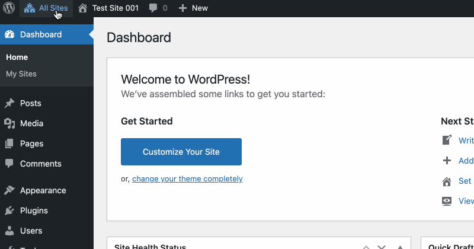

# Super Admin All Sites Menu

For the super admin, replace WP Admin Bar My Sites menu with an All Sites menu.

- Doesn't use `switch_to_blog()`, i.e. Super Admin All Sites Menu is faster and uses less resources than the WP Admin Bar My Sites menu.
- Subsite menu data are stored locally in IndexedDB (did I say it's fast?). The local storage is updated when;
  - the plugin is activated.
  - a site is added or deleted.
  - you change a blog name.
  - IndexedDB is out of sync with site changes.
  - [Restricted Site Access](https://github.com/10up/restricted-site-access) is activated or deactivated.
- When subsite menu data is updated, AJAX is used and it's done in increments (100 sites per increment).
- List all subsites. WP Admin Bar My Sites only list sites you're a local admin on.
- Mark sites that has [restricted site access](https://github.com/10up/restricted-site-access) with a red icon.
- Sites menu is sorted alphabetically.
- Search filter.
- Add more menu choices:
  - Under "Network Admin"
    - Add New Site
  - Per subsite.
    - 'New Page'
    - 'Users'
    - 'Plugins'
    - 'Settings'

## Demo



## IndexedDB

Menu data are stored locally in IndexedDB.


## Prerequisite

- WordPress Multisite
- A modern browser, IE 11 isn't supported.

## Install

- [Download the plugin](https://github.com/soderlind/super-admin-all-sites-menu/archive/refs/heads/main.zip)
- [Upload and network activate the plugin](https://wordpress.org/support/article/managing-plugins/#manual-upload-via-wordpress-admin)

## Filters

You can use the following filters to override the defaults:

- `all_sites_menu_order_by`
  - Sort menu by. Default value is `name`, accepts `id`, `url` or `name`
    ```php
    add_filter( 'all_sites_menu_order_by', function( string $order_by ) : string {
    	return 'url';
    } );
    ```
- `all_sites_menu_load_increments`
  - AJAX load increments. Default value is 100.
  ```php
  add_filter( 'all_sites_menu_load_increments', function( int $increments ) : int {
  	return 300;
  } );
  ```
- `all_sites_menu_plugin_trigger`
  - Trigger an update of local storage (IndexedDB) when a plugin is (de)activated. Default is `[ 'restricted-site-access/restricted_site_access.php' ]`.
    > Note: Must be an array and each element in the array must point to the main plugin file. Syntax `'plugin-dir/plugin-file.php'`
  ```php
   add_filter( 'all_sites_menu_plugin_trigger', function( array $plugins ) : array {
  	return [
  		'restricted-site-access/restricted_site_access.php',
  		'myplugin/myplugin.php',
  	];
  } );
  ```
- `all_sites_menu_search_threshold`
  - Don't display search field if there's less than N subsites. Default value is 20.
  ```php
  add_filter( 'all_sites_menu_load_increments', function( int $increments ) : int {
  	return 40;
  } );
  ```

## Changelog

See [CHANGELOG.md](CHANGELOG.md)

## Credits

- [Dexie.js](https://github.com/dfahlander/Dexie.js), which has an Apache License Version 2.0
- Submmenu offset adjustment: https://qiita.com/zephyr7501/items/dd0967fddabd888b28c4
- CSS for search field from https://github.com/trepmal/my-sites-search

## Copyright and License

Super Admin All Sites Menu is copyright 2021 Per Soderlind

Super Admin All Sites Menu is free software: you can redistribute it and/or modify it under the terms of the GNU General Public License as published by the Free Software Foundation, either version 2 of the License, or (at your option) any later version.

Super Admin All Sites Menu is distributed in the hope that it will be useful, but WITHOUT ANY WARRANTY; without even the implied warranty of MERCHANTABILITY or FITNESS FOR A PARTICULAR PURPOSE. See the GNU General Public License for more details.

You should have received a copy of the GNU Lesser General Public License along with the Extension. If not, see http://www.gnu.org/licenses/.
