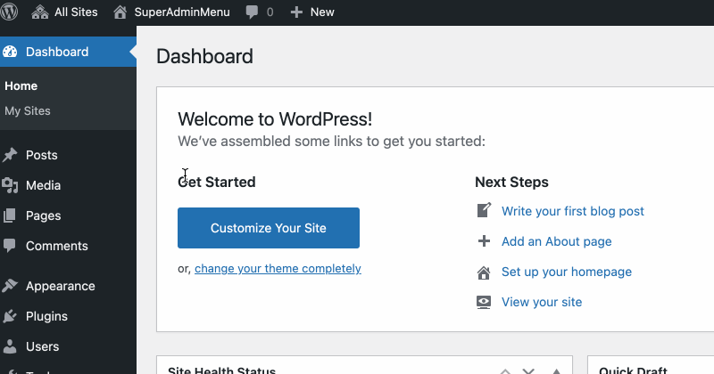
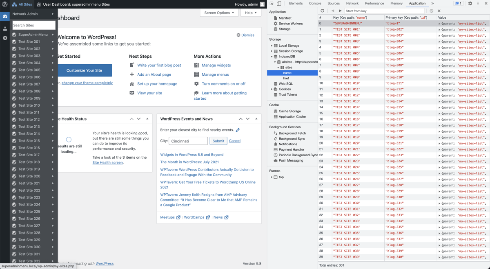

# Super Admin All Sites Menu

[](https://wordpress.org/plugins/super-admin-all-sites-menu/)
[](https://wordpress.org/plugins/super-admin-all-sites-menu/)
[](LICENSE)

Replace the default **My Sites** menu in the WordPress Admin Bar with a fast, searchable **All Sites** menu — built for super admins managing large multisite networks.



## Why?

The built-in My Sites menu has problems on large networks:

- It only lists sites where you are a local admin.
- It [can't scroll past the viewport](https://core.trac.wordpress.org/ticket/15317) (open bug since 2010).
- It calls `switch_to_blog()` for every site, which is slow.

This plugin fixes all three. Site data is fetched once via the REST API, cached in **IndexedDB**, and rendered client-side — so the menu loads instantly on subsequent visits.

## Features

- **[Switch free](docs/switch-free.md), no `switch_to_blog()`** — reads site properties directly, avoiding the performance hit.
- **IndexedDB caching** — menu data is stored locally and updated automatically when sites, blog names, or monitored plugins change.
- **Incremental REST loading** — fetches sites in batches (default 100) so the admin bar isn't blocked.
- **Lists every subsite**, not just sites you administer locally.
- **Alphabetical sorting** with a built-in **search filter** (appears when you have 20+ sites).
- **Restricted Site Access indicator** — sites running [Restricted Site Access](https://github.com/10up/restricted-site-access) get a red icon.
- **Extra quick-links** per site: New Page, Users, Plugins, Settings; plus "Add New Site" under Network Admin.

## Requirements

| Requirement | Minimum |
|---|---|
| WordPress | 5.6 (Multisite) |
| PHP | 8.0 |
| Browser | Any modern browser (no IE 11) |

## Installation

**WordPress.org**

Install from [wordpress.org/plugins/super-admin-all-sites-menu](https://wordpress.org/plugins/super-admin-all-sites-menu/), then **Network Activate**.

**Manual**

1. [Download the latest release](https://github.com/soderlind/super-admin-all-sites-menu/releases/latest).
2. Upload to `wp-content/plugins/` and [network activate](https://wordpress.org/support/article/managing-plugins/#manual-upload-via-wordpress-admin).

**Composer**

```bash
composer require soderlind/super-admin-all-sites-menu
```

## Filters

All filters are optional. Add them to a plugin or your theme's `functions.php`.

### `all_sites_menu_order_by`

Sort order. Accepts `name` (default), `id`, or `url`.

```php
add_filter( 'all_sites_menu_order_by', function( string $order_by ): string {
    return 'url';
} );
```

### `all_sites_menu_load_increments`

Sites fetched per REST batch. Default `100`.

```php
add_filter( 'all_sites_menu_load_increments', function( int $increments ): int {
    return 300;
} );
```

### `all_sites_menu_plugin_trigger`

Plugins whose (de)activation triggers an IndexedDB refresh. Default: `[ 'restricted-site-access/restricted_site_access.php' ]`.

```php
add_filter( 'all_sites_menu_plugin_trigger', function( array $plugins ): array {
    return [
        'restricted-site-access/restricted_site_access.php',
        'myplugin/myplugin.php',
    ];
} );
```

### `all_sites_menu_search_threshold`

Minimum number of sites before the search field appears. Default `20`.

```php
add_filter( 'all_sites_menu_search_threshold', function( int $threshold ): int {
    return 40;
} );
```

### `all_sites_menu_force_refresh_expiration`

Seconds between forced cache refreshes. Default `3600` (1 hour). Set to `0` to disable.

```php
add_filter( 'all_sites_menu_force_refresh_expiration', function( int $seconds ): int {
    return 7200;
} );
```

### `all_sites_menu_submenu_items`

Customise the per-site submenu items. Add, remove, or reorder entries. Each item is an associative array with `id`, `title`, and `href` keys.

**Parameters:**

| Param | Type | Description |
|---|---|---|
| `$items` | `array` | Default submenu items (Dashboard, New Post, New Page, …, Visit). |
| `$blog_id` | `int` | The numeric blog ID. |
| `$admin_url` | `string` | The site admin URL, e.g. `https://example.com/wp-admin`. |
| `$site_url` | `string` | The site frontend URL, e.g. `https://example.com`. |

**Add an "Edit Site" link (network admin):**

```php
add_filter( 'all_sites_menu_submenu_items', function( array $items, int $blog_id, string $admin_url ): array {
    $items[] = [
        'id'    => 'edit-site',
        'title' => 'Edit Site',
        'href'  => network_admin_url( 'site-info.php?id=' . $blog_id ),
    ];
    return $items;
}, 10, 3 );
```

**Remove "Manage Comments":**

```php
add_filter( 'all_sites_menu_submenu_items', function( array $items ): array {
    return array_filter( $items, fn( $item ) => $item['id'] !== 'c' );
} );
```

## Demo

Try it in [WordPress Playground](https://playground.wordpress.net/?blueprint-url=https://raw.githubusercontent.com/soderlind/super-admin-all-sites-menu/refs/heads/main/blueprint.json) (loads 50 subsites — may take a moment).

- Deactivate the plugin to see the default My Sites menu fail to scroll.
- Activate **Restricted Site Access** to see the red indicator icon.

## How it works

```
PHP (server)                        JS (browser)
─────────────                       ────────────
get_revision() ──inline_script──▶   pluginAllSitesMenu.revision
                                 │
                        Compare with snapshot metadata revision
                                 │
                        ┌──────────┴──────────┐
                        │ mismatch             │ match
                        ▼                      ▼
                    Clear DB              Use cached snapshot
                        │                      │
                        ▼                      │
                REST /sites?offset=0             │
                REST /sites?offset=100           │
                …(batched)                       │
                        │                      │
                        ▼                      ▼
                    Store in IndexedDB ──▶ Render menu
```

The PHP revision acts as an opaque cache version. It is bumped whenever a site is added/deleted, a blog name changes, or a monitored plugin is (de)activated. On the client side, a mismatch triggers a full re-fetch; a match means the cached snapshot is used as-is.

<details>
<summary>IndexedDB storage</summary>



</details>

## Development

```bash
# Install dependencies
npm install

# Build
npm run build

# Run tests
npm test

# Format source
npm run format
```

## Changelog

See [CHANGELOG.md](CHANGELOG.md).

## Credits

- [Dexie.js](https://github.com/dfahlander/Dexie.js) (Apache 2.0) — IndexedDB wrapper
- Submenu offset adjustment — [zephyr7501](https://qiita.com/zephyr7501/items/dd0967fddabd888b28c4)
- Search field CSS — [trepmal/my-sites-search](https://github.com/trepmal/my-sites-search)

## License

Copyright 2021 Per Soderlind. Licensed under the [GNU General Public License v2 or later](LICENSE).

You should have received a copy of the GNU Lesser General Public License along with the Extension. If not, see http://www.gnu.org/licenses/.
